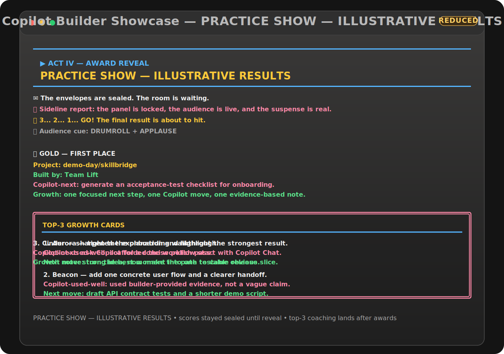

# 🏆 Copilot Builder Showcase

**Turn any workshop into a live Copilot Builder Showcase.**

Drop the links, activate the judging panel, and spotlight the winners—in under
two minutes.

[](https://github.com/features/copilot)
[](https://github.com/DUBSOpenHub/copilot-builder-showcase/actions/workflows/ci.yml)
[](LICENSE)
[](SECURITY.md)

> ### ⚡ One command. That's it.
>
> **Never used Copilot Builder Showcase before?**
>
> 1. Open a terminal.
> 2. On macOS or Linux, paste:
>    ```bash
>    bash -o pipefail -c 'gh api repos/DUBSOpenHub/copilot-builder-showcase/contents/install.sh \
>      -H "Accept: application/vnd.github.raw+json" | bash'
>    ```
>    On Windows, use the PowerShell command in [Install](#-install).
> 3. Type:
>    ```bash
>    showcase
>    ```
> 4. Paste project or demo links, one per line. Press Return on an empty line.
>
> *Requires Git, an authenticated GitHub CLI, and Python 3.11+. Official judging uses an authenticated GitHub Copilot CLI.*



---

## 🚀 30-Second Overview

Copilot Builder Showcase is for the awkward final ten minutes after people build things
together:

- **Have a list of projects but no ending?** Paste the links once.
- **Want every project to be seen?** Every accepted entry gets a spotlight.
- **Need a consistent review?** The same rubric and panel policy apply to all.
- **Want the room involved?** The audience joins a quick final reveal.
- **Need more than applause?** Each run preserves awards, private feedback, and replay evidence.

The default result is one watchable Terminal showcase with a real podium:
**Builder Bronze**, **Builder Silver**, and the first-place **Copilot Builder Award**.

---

## 💬 The Problem

Builder workshops, product demos, conference sessions, and online challenges are
good at creating projects—and bad at ending.

The links scatter across chat threads, shared documents, and browser tabs. A few
people get demo time. Most projects receive no consistent review. The audience
has nothing to follow, and the session simply stops.

A human judging panel would create a shared resolution, but recruiting judges,
reviewing every entry, producing feedback, and running an award ceremony is too
much overhead for most sessions.

> **Copilot Builder Showcase turns that loose project list into a finale everyone can watch and join.**

---

## 🤔 What Is This?

Copilot Builder Showcase is a one-command judging showcase for projects built during
a shared session. The host pastes links. A sealed Copilot panel reviews every
project through the same rubric. The showcase spotlights each entry, invites the
audience into the reveal, and saves the result as a replayable bundle.

It gives any workshop the energy and resolution of a judged finale.

| Before | With Copilot Builder Showcase |
|---|---|
| Links sit in a chat or spreadsheet | The host pastes the complete list once |
| Only a few people get demo time | Every accepted project gets a spotlight |
| Review quality depends on who speaks up | Every project uses the same declared rubric |
| The session ends after the final demo | The room joins a short recognition reveal |
| Feedback and decisions disappear | Awards, feedback, validation, and replay stay together |

---

## ⏰ Why Now?

AI tools let more people build credible projects during a workshop or challenge.
The amount of output has grown, but the way those sessions end has not. Hosts
still collect links, pick a few demos, and move on.

Copilot Builder Showcase closes that loop: every project gets a fair moment, the group
gets something fun to watch, and the work gets a clear shared ending.

---

## 🎯 Use Cases

### 🧑‍🏫 Builder workshop

Twenty people finish a two-hour workshop with twenty different prototypes.
Paste the links and give the room a shared finale instead of ending on cleanup
instructions.

### 🎤 Product demo session

A team brings several experiments to demo day. Run one consistent panel,
spotlight every project, and leave each builder with private next-step feedback.

### 🏟️ Conference project showcase

Attendees build for fun during a conference session. Turn the final project list
into a short audience moment without recruiting judges in advance.

### 🌐 Online build challenge

Participants submit links from different time zones. Preserve a consistent
review, recognition slate, and replay bundle even when the builders cannot all
present live.

---

## 🎬 What Happens in the Live Showcase?

```text
project links -> sealed panel review -> every project gets a spotlight
              -> audience cue -> recognition reveal -> feedback + replay
```

1. **Projects enter** — HTTP(S) project links and GitHub `owner/repo` entries
   become project cards.
2. **The rapid panel reviews** — one compact Copilot scorecard applies Innovation,
   Build Quality, and Impact lenses to each project while scores remain sealed.
   Official events keep the configured panel policy and do not silently downgrade
   to a single-model decision.
3. **Every project gets a spotlight** — three brief judge reactions appear without
   exposing scores or rank.
4. **The room joins in** — a quick audience cue asks for a drumroll, countdown,
   applause check, or another participation moment.
5. **The podium lands** — third place, second place, then the first-place Copilot
   Builder Award.
6. **The work stays useful** — recap, private feedback, validation, export, and
   replay are saved together.
7. **Top-three growth cards land after awards** — each podium project gets
   improvement guidance, a Copilot-next suggestion, and an evidence-based
   Copilot-use note.

The complete showcase runs in one visible Terminal. Copilot Builder Showcase never
auto-opens a dashboard or second audience window.

Every run keeps its status visible:

| Status | Meaning |
|---|---|
| **PRACTICE SHOWCASE — ILLUSTRATIVE RESULTS** | Deterministic local judges are active. Use this for rehearsal and demonstration, not official awards. |
| **OFFICIAL COPILOT PANEL** | A connected Copilot panel reviewed the projects. |

---

## 📦 Install

### Instant install

**macOS or Linux**

```bash
bash -o pipefail -c 'gh api repos/DUBSOpenHub/copilot-builder-showcase/contents/install.sh \
  -H "Accept: application/vnd.github.raw+json" | bash'
```

**Windows PowerShell**

```powershell
$installer = Join-Path $env:TEMP "install-copilot-builder-showcase.ps1"
gh api repos/DUBSOpenHub/copilot-builder-showcase/contents/install.ps1 `
  -H "Accept: application/vnd.github.raw+json" > $installer
if ($LASTEXITCODE -ne 0) { throw "Installer download failed." }
powershell -ExecutionPolicy Bypass -File $installer
```

Then run:

```bash
showcase
```

The installer:

- checks for Git and Python 3.11+,
- installs into `~/.local/share/copilot-builder-showcase`,
- creates `showcase` and `copilot-builder-showcase` launchers in `~/.local/bin`,
- preserves `hackathon` and `hackathon-judge` as compatibility aliases,
- never edits your shell profile,
- and treats the optional Textual monitor as non-blocking.

> 💡 **Security note:** Inspect [install.sh](install.sh) or
> [install.ps1](install.ps1) before execution if that is your preferred
> installation policy.

### Clone and install

**macOS or Linux**

```bash
gh repo clone DUBSOpenHub/copilot-builder-showcase
cd copilot-builder-showcase
bash install.sh
```

**Windows PowerShell**

```powershell
gh repo clone DUBSOpenHub/copilot-builder-showcase
Set-Location copilot-builder-showcase
powershell -ExecutionPolicy Bypass -File .\install.ps1
```

Windows 10 or 11 with Windows Terminal or a modern PowerShell host is
recommended for the Unicode ceremony and ANSI color output.

For an Official Copilot Panel on Windows, install the native CLI:

```powershell
winget install GitHub.Copilot
```

Copilot Builder Showcase requires `copilot.exe` for official Windows judging
and rejects `.cmd` or `.bat` shims so project text never passes through
`cmd.exe`. Practice showcases do not require Copilot CLI.

---

## 🧪 Try the Complete Practice Showcase

```bash
showcase --demo
```

The bundled three-project demo avoids network metadata calls, follows the same
intake-to-replay flow, and targets completion within two minutes. It requires no
Copilot model calls and is always labeled:

```text
PRACTICE SHOWCASE — ILLUSTRATIVE RESULTS
```

---

## 🤖 Connect an Official Copilot Panel

Official judging runs through your authenticated
[GitHub Copilot CLI](https://docs.github.com/copilot/how-tos/copilot-cli).
Sign in once, then check the panel:

```bash
copilot login
showcase doctor
showcase --official https://example.com/project-one https://example.com/project-two
```

No separate model API key or provider SDK is required. Copilot Builder Showcase invokes
Copilot in non-interactive, tool-free mode and disables repository instructions,
built-in MCP servers, remote control, and file or shell tools for every judge
call.

The default EventSpec declares a three-family Copilot panel. You can configure
one to three Copilot model IDs, the minimum panel size, provider diversity,
concurrency, and reasoning requirements in your event file.

If `--official` is used without an authenticated Copilot CLI, the command
blocks. It never silently converts an official event into a practice result.
Official scoring policy is preserved even in rapid scorecard mode; it never
falls back to a hidden single-model panel.

---

## 🔗 Project Links Are Enough

The beginner input can mix any safe HTTP(S) project or demo links:

```text
https://github.com/example/project-one
example/project-two
https://demo.example.com/aurora
https://example.net/showcase/project-three
```

GitHub links may use public repository metadata for a richer spotlight. Generic
links are not fetched by the intake process; Copilot Builder Showcase derives a safe
project label from the URL and uses only the context the organizer supplies.

For advanced events, add optional context after each link:

```text
https://demo.example/aurora | Team Aurora | Used Copilot for API design | Built a retrieval agent | Reduce missed follow-ups | Account executives | https://demo.example/aurora | Daily workflow demo
```

The optional fields are team or builder, Copilot evidence, frontier evidence,
problem statement, intended user, demo or artifact URL, and builder notes.
Copilot Builder Showcase never infers Copilot or frontier-model use from a link, code,
metadata, or judge impression.

---

## 🏅 A Real Podium, Useful Feedback

Every project receives a brief on-screen review. Only the top three receive awards:

| Award | Selection |
|---|---|
| 🥉 **Third Place — Builder Bronze** | Third-highest complete result |
| 🥈 **Second Place — Builder Silver** | Second-highest complete result |
| 🏆 **First Place — Copilot Builder Award** | Strongest complete result |

Each award explains why the project placed, what the panel uniquely liked, and one
specific level-up move. After the reveal, top-three growth cards add:
1. one improvement move,
2. one optional Copilot next move,
3. one Copilot-use summary sourced only from builder-provided evidence.

Exact ties follow the event's declared policy: shared placement, a predeclared
rubric tiebreaker, or a logged human decision.

Formal events can replace this slate with a traditional podium or any custom
recognitions in the EventSpec.

---

## 👻 Hidden Quality Review

The visible rubric is not the only check.

Before judging, Copilot Builder Showcase creates a second sealed diagnostic review. After
the panel finishes, it checks for issues such as unsupported claims, shallow
evidence, rubric gaps, calibration problems, and score leakage.

This hidden review:

- stays sealed until the awards stage,
- never changes public scores, rankings, or awards,
- gives the organizer private warnings when a result deserves another look,
- and remains diagnostic-only by design.

The approach follows the sealed-envelope principles behind
[Shadow Score Spec](https://github.com/DUBSOpenHub/shadow-score-spec) without
turning hidden criteria into a secret way to choose winners.

---

## 🛡️ Fair by Default

| Guardrail | What it means |
|---|---|
| Persistent result status | Practice or Official status remains visible throughout the showcase and in the manifest. |
| Sealed scores | Scores, rankings, prompts, and unrevealed awards stay hidden until the reveal. |
| Equal spotlight | Every accepted project appears before the recognition ceremony. |
| Same declared rubric | Every entry uses the same snapshotted review policy. |
| Multi-model consensus | Official panels combine configured judges using median consensus. |
| Strict official panel policy | Rapid scorecards keep configured panel policy and never silently downgrade to one model. |
| Evidence, not inference | Copilot and frontier claims require builder-provided evidence. |
| Hidden diagnostic review | The Shadow Spec can warn the organizer but cannot alter winners. |
| Declared tie policy | Exact ties use the event policy, never input order. |
| Read-only replay | Replays use stored artifacts and never call a judge. |
| Tamper evidence | Exported bundles include `HASHES` and `SEAL` integrity records. |

Run bundles may contain project context and judge feedback. Treat them as
internal artifacts unless a human approves publication. See
[SECURITY.md](SECURITY.md).

---

## 🚫 When Not to Use It

- **A regulated or legally consequential decision** — use qualified human judges
  and the required review process.
- **Projects contain secrets or restricted data** — do not submit context that
  cannot be shared with the configured model provider.
- **You need expert certification** — a Copilot panel is not a substitute for domain
  accreditation, safety review, or compliance approval.
- **You only need private feedback on one project** — a direct review is simpler
  than producing a live group finale.

Copilot Builder Showcase is built for shared learning, recognition, and event resolution.
Human approval remains required before external publication.

---

## 📁 After the Showcase

Runs are stored under:

```text
~/.copilot_builder_showcase/runs/<run-id>/
```

Useful commands:

```bash
showcase replay <run-id>
showcase validate <run-id>
showcase feedback <run-id>
showcase doctor
```

Private feedback includes what judges liked, an actionable next step, an
optional Copilot next move, and a bounded frontier experiment. Unsupported ideas
are labeled as hypotheses.

---

## ⚙️ Customize the Event

Copy the starter EventSpec:

```bash
cp ~/.local/share/copilot-builder-showcase/config/event.example.json my-event.json
```

Run the same showcase with your configuration:

```bash
showcase \
  --event my-event.json \
  --file submissions.txt \
  --run-id spring-demo-day \
  --require-live-terminal \
  --yes
```

The EventSpec defines:

- event name and tagline,
- scoring dimensions and review lenses,
- recognition categories and tie behavior,
- privacy and accessibility defaults,
- live-panel models and policy,
- presentation behavior,
- and the diagnostic Shadow Spec.

Every run snapshots its resolved configuration so later edits cannot rewrite a
past result.

---

## ❓ FAQ

### Do I need an API key?

No separate API key is required. The practice showcase is local and illustrative;
an Official Copilot Panel uses your authenticated GitHub Copilot CLI subscription.

### What links can I paste?

Any safe HTTP(S) project or demo URL, plus GitHub `owner/repo` shorthand.

### Does Copilot Builder Showcase open every website I paste?

No. Generic non-GitHub links are not fetched during intake. GitHub repository
links may use public metadata when available.

### How are winners chosen?

The panel scores the declared rubric, official model responses are combined by
median consensus, and recognitions follow their declared dimensions and tie
policy.

### What does the hidden Shadow review do?

It independently checks review quality and possible failure modes. It can warn
the organizer, but it cannot change scores, rankings, or awards.

### Can I replay a showcase without spending more model calls?

Yes. Replay reads the sealed bundle and never contacts a judge.

### Is the output public?

No. Run bundles and feedback are internal by default. A human must approve
external publishing.

---

## 🧭 Use It from Copilot CLI

Add the skill:

```text
/skills add DUBSOpenHub/copilot-builder-showcase
```

Then type:

```text
showcase
```

The skill checks whether the command is installed, asks permission before
installing anything, runs `showcase doctor`, and opens exactly one real macOS
Terminal for the audience experience.

---

## 📋 Command Reference

| Command | Use it for |
|---|---|
| `showcase` | Paste links and start the complete live showcase. |
| `showcase <links...>` | Start immediately with supplied projects. |
| `showcase --demo` | Run the bundled two-minute practice showcase. |
| `showcase --reduced-motion` | Prefer low-motion reveal pacing in the live showcase. |
| `showcase --official <links...>` | Require a connected official Copilot panel. |
| `showcase replay <run-id>` | Replay a prior showcase without judge calls. |
| `showcase validate <run-id>` | Verify bundle hashes and seals. |
| `showcase feedback <run-id>` | Write private per-project feedback. |
| `showcase doctor` | Check setup, panel connection, and bundle health. |
| `showcase tui <run-id> --projector` | Open the optional diagnostic monitor. |

The installer also preserves `hackathon` and `hackathon-judge` as compatibility
aliases for existing scripts.

---

## 🏗️ How It Is Built

```text
EventSpec -> project intake -> consensus review -> sealed artifacts
          -> audience-safe showcase -> recognitions -> export/replay
```

- `showcase_launcher.py` is the beginner `showcase` entry point.
- `builder_showcase.py` is the canonical engine and advanced CLI.
- `builder_showcase_dashboard.py` is the optional Textual run monitor.
- `bundle_reader.py` creates audience-safe and operator views.
- `event_spec.py` resolves portable event configuration and legacy bundles.

The primary live showcase uses the Python standard library. Textual is optional and
an installation failure never blocks the showcase.

---

## 🛠️ Develop

```bash
python3 -m pytest -q
python3 -m py_compile showcase_launcher.py builder_showcase.py builder_showcase_dashboard.py event_spec.py bundle_reader.py
bash -n install.sh
```

---

## 🤝 Contributing

Keep the default experience neutral, beginner-first, and audience-safe. Do not
commit run bundles, credentials, or confidential project metadata. See
[AGENTS.md](AGENTS.md) for the working invariants.

---

## 📄 License

[MIT](LICENSE) — use it, fork it, build on it.

---

## 🐙 Credits

🐙 Created with 💜 by [@DUBSOpenHub](https://github.com/DUBSOpenHub) with the
[GitHub Copilot CLI](https://docs.github.com/copilot/concepts/agents/about-copilot-cli).
