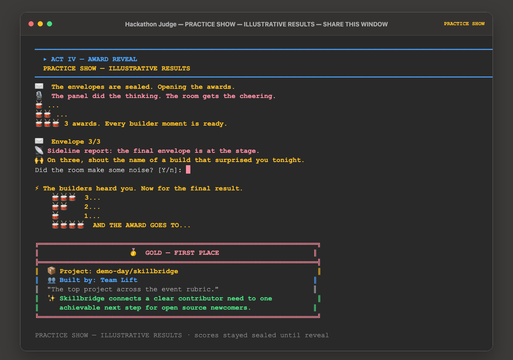

# Hackathon Judge

> **Most hackathons spend hours building and end with judges staring at a
> spreadsheet. Hackathon Judge turns project links into a fair, watchable
> awards show.**

Hackathon Judge is a one-command live judging room for hackathons, build
sprints, and demo days. Organizers paste GitHub links once. Every project is
reviewed against the same rubric, introduced to the room, and given private
feedback. Scores stay sealed until the audience joins the final reveal, and the
entire event is preserved as a tamper-evident replay.

It starts with the hardest ten minutes of a hackathon: judging the projects and
revealing a winner without losing the room.

- **Built for:** hackathon organizers and event facilitators
- **Input:** a list of GitHub project links
- **Live experience:** one shared Terminal, one spotlight per build, one sealed reveal
- **Proof:** the bundled three-project show runs end to end in under two minutes


[](SECURITY.md)

## Run your first show

### 1. Install in one command

```bash
gh api -H "Accept: application/vnd.github.raw" \
  repos/DUBSOpenHub/hackathon-judge/contents/install.sh | bash
```

### 2. Type `hackathon`

```bash
hackathon
```

Paste one project link per line and press Return on an empty line. You can also
start immediately:

```bash
hackathon owner/project-one owner/project-two owner/project-three
```

The installer needs Git, Python 3.11+, and an authenticated
[GitHub CLI](https://cli.github.com/) with access to this repository. It prints
one PATH command if `~/.local/bin` is not already available in your shell.



## From spreadsheet to show

| The usual finish | With Hackathon Judge |
| --- | --- |
| Judges bounce between tabs and spreadsheets | The organizer pastes every project link once |
| Feedback depends on which judge saw which build | Every project follows the same sealed review flow |
| The audience waits while judges operate admin tools | Every accepted build gets a visible spotlight |
| A winner is announced without context | The room joins a short, suspenseful final reveal |
| Results disappear after the event | The recap, feedback, awards, and replay stay together |

## Why now

Modern build tools let more people ship credible demos in a day. Events now have
more projects, more first-time builders, and less time to give each one a fair
moment. Judging has become the bottleneck, and the final ten minutes still run
like an internal meeting.

Hackathon Judge gives those ten minutes their own product experience: fast
enough for the room, structured enough for the judges, and memorable enough for
the builders.

No Python command, mode picker, team spreadsheet, panel setup, or EventSpec is
required. When no team name is supplied, Hackathon Judge labels the entry from
the repository owner, such as `octocat team`.

## Try the complete practice show

```bash
hackathon --demo
```

The bundled demo uses three neutral projects, avoids network metadata calls, and
runs the same intake-to-replay experience. It targets completion within two
minutes when the operator promptly confirms the audience cue.

Every installed run is clearly labeled throughout the show:

| Status | Meaning |
| --- | --- |
| **PRACTICE SHOW — ILLUSTRATIVE RESULTS** | Local practice judges are active. Results are useful for rehearsal and demonstration, not official awards. |
| **OFFICIAL LIVE PANEL** | A host integration connected live judges for an official event. |

Use `hackathon --official ...` when an official panel is mandatory. The command
blocks before creating a run if no live panel is connected; it never silently
turns an official event into a practice result.

## Use it from Copilot CLI

Add the skill:

```text
/skills add DUBSOpenHub/hackathon-judge
```

Then say:

```text
hackathon
```

Paste links with the request or when prompted. The skill checks whether the
command is installed, asks permission before installing anything, runs a setup
check, and opens exactly one real macOS Terminal for the audience experience.

## The one experience

```text
project links -> intake -> sealed reviews -> project spotlights
              -> audience moment -> bronze/silver/gold -> sealed replay
```

1. **Projects enter:** Links become project cards automatically.
2. **The panel reviews:** Results stay sealed while every project is evaluated
   through the same configured lenses.
3. **Every build gets a spotlight:** A generic sideline reporter shares concise,
   project-specific highlights without leaking scores or rank.
4. **The room joins in:** One of ten audience cues asks for a drumroll, clap,
   countdown, or other quick participation moment.
5. **The operator confirms:** The final result remains sealed until the room is
   participating.
6. **The awards land:** Bronze, silver, and gold arrive with a short moment of
   joy, followed by recap, validation, and replay.

The complete run appears in one Terminal. Hackathon Judge never auto-opens a
dashboard or second audience window.

## Project links are enough

The beginner input is simply:

```text
https://github.com/example/project-one
example/project-two
```

Repository metadata provides the project name and public context. Hackathon
Judge never infers Copilot or frontier-model use from a link, code, or metadata;
those claims require explicit builder evidence.

For advanced events, a text file may add optional context after each link:

```text
https://github.com/example/project | Team Aurora | Used Copilot Chat for API design | Built an agent workflow with retrieval | Reduce missed follow-ups | Account executives | https://demo.example/aurora | Daily workflow demo
```

The optional fields are team or builder, Copilot evidence, frontier evidence,
problem statement, intended user, demo URL, and builder notes.

## After the show

The Live Show automatically writes a recap, exports the bundle, validates its
hashes and seal, and verifies a stored-artifact replay. Useful follow-up
commands are:

```bash
hackathon replay <run-id>
hackathon validate <run-id>
hackathon feedback <run-id>
hackathon doctor
```

Feedback is private and human-reviewable. It includes what judges liked, an
actionable next step, a Copilot next move, and an optional frontier experiment.
Unsupported ideas are labeled as hypotheses, and human approval is required
before external delivery.

## Advanced event customization

Copy the portable event pack:

```bash
cp ~/.local/share/hackathon-judge/config/event.example.json my-event.json
```

Then keep the same beginner command:

```bash
hackathon \
  --event my-event.json \
  --file submissions.txt \
  --run-id spring-demo-day \
  --require-live-terminal \
  --yes
```

The EventSpec defines the event name, rubric, review lenses, awards, privacy,
accessibility, panel policy, and presentation defaults. Every run snapshots its
resolved configuration so later edits cannot rewrite a past result.

Exact ties follow the sealed event policy: shared podium by default, a
predeclared rubric tiebreaker, or an explicit human decision. Submission order
is never a hidden tiebreaker.

## Fair by default

| Guardrail | What it means |
| --- | --- |
| Persistent result status | Practice or Official status stays visible in the title, opening, act breaks, run card, receipt, and manifest. |
| Sealed scores | Scores and rankings stay hidden until awards are declared. |
| Single audience surface | The shared Terminal never shows unrevealed scores, prompts, ranks, or awards. |
| Equal spotlight | Every accepted project appears before the ceremony. |
| Evidence, not inference | Copilot and frontier claims require builder-provided evidence. |
| Declared tie policy | Ties use the event policy, never input order. |
| Read-only replay | Replays use stored artifacts and never call a judge. |
| Tamper evidence | Exported bundles include `HASHES` and `SEAL` integrity records. |

Run bundles can contain project metadata and judge feedback. Treat them as
internal artifacts unless a human approves publication. See
[SECURITY.md](SECURITY.md) for reporting guidance.

## Command reference

| Command | Use it for |
| --- | --- |
| `hackathon` | Pasting links and starting the complete Live Show. |
| `hackathon <links...>` | Starting immediately with supplied projects. |
| `hackathon --demo` | Running the bundled two-minute Practice Show. |
| `hackathon --official <links...>` | Requiring a connected Official Live Panel. |
| `hackathon replay <run-id>` | Replaying a prior event without judge calls. |
| `hackathon validate <run-id>` | Verifying bundle hashes and seals. |
| `hackathon feedback <run-id>` | Writing private per-project feedback. |
| `hackathon doctor` | Checking setup, panel connection, and bundle health. |
| `hackathon tui <run-id> --projector` | Opening the optional diagnostic monitor. |

The installer also preserves `hackathon-judge` as the full compatibility CLI for
advanced automation and existing scripts.

## How it is built

```text
EventSpec -> intake -> consensus review -> sealed artifacts
          -> audience-safe show -> awards -> export/replay
```

- `hackathon_launcher.py` is the beginner `hackathon` entry point.
- `hackathon_judge.py` is the canonical engine and advanced CLI.
- `hackathon_judge_dashboard.py` is the optional Textual run monitor.
- `bundle_reader.py` creates audience-safe and operator views.
- `event_spec.py` resolves portable event configuration and legacy bundles.

The primary Live Show uses the Python standard library. Textual is an optional
monitor dependency; an installation failure never blocks the show.

## Develop

```bash
python3 -m pytest -q
python3 -m py_compile hackathon_launcher.py hackathon_judge.py hackathon_judge_dashboard.py event_spec.py bundle_reader.py
bash -n install.sh
```

## Contributing

Keep the default experience neutral, beginner-first, and audience-safe. Do not
commit run bundles, credentials, or confidential project metadata. The working
invariants and canonical surfaces are in [AGENTS.md](AGENTS.md).

## Credits

Created with care by [@DUBSOpenHub](https://github.com/DUBSOpenHub) with the
[GitHub Copilot CLI](https://docs.github.com/copilot/concepts/agents/about-copilot-cli).
