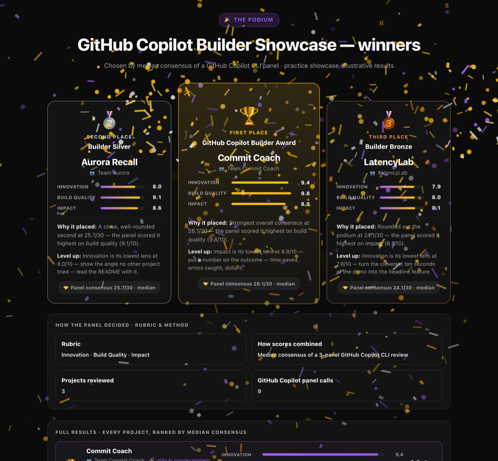
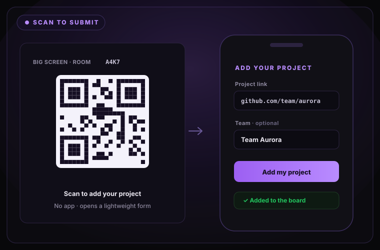
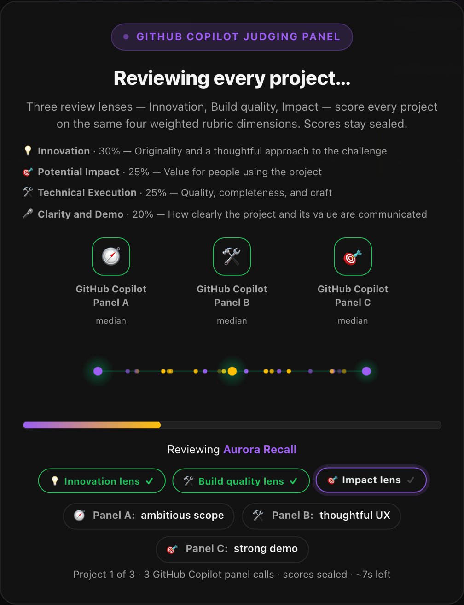

<div align="center">

# 🏆 GitHub Copilot Builder Showcase

**End every workshop with a GitHub Copilot Builder Showcase.**

Paste the links, activate the panel, reveal the winners — in under two minutes.

[](https://github.com/features/copilot)
[](https://github.com/DUBSOpenHub/copilot-builder-showcase/actions/workflows/ci.yml)
[](LICENSE)
[](SECURITY.md)

**[Live demo](https://dubsopenhub.github.io/copilot-builder-showcase/) · [What it does](#what-it-does) · [Install](#install) · [How it works](#how-it-works) · [From the CLI](#from-the-cli) · [FAQ](#faq) · [License](#license-and-credits)**



*Every accepted project gets a spotlight and the same sealed GitHub Copilot review. Only the top three take the podium — Builder Bronze, Builder Silver, and the first-place GitHub Copilot Builder Award.*

</div>

---

> ### ⚡ One command. That's it.
>
> **Never used GitHub Copilot Builder Showcase before?**
>
> 1. Open a terminal.
> 2. On macOS or Linux, paste:
>    ```bash
>    curl -fsSL https://raw.githubusercontent.com/DUBSOpenHub/copilot-builder-showcase/main/install.sh | bash
>    ```
>    On Windows, use the PowerShell command in [Install](#install).
> 3. Type:
>    ```bash
>    showcase
>    ```
>    If that command is not on your PATH yet, run `~/.local/bin/showcase` on macOS/Linux or `$HOME\.local\bin\showcase.exe` on Windows.
> 4. Paste project or demo links, one per line. Press Return on an empty line.
>
> *Requires Git and Python 3.11+ for practice installs — no GitHub login needed. Official judging uses an authenticated GitHub Copilot CLI.*

**Which one are you?** [🎤 Running a workshop](#-im-running-a-workshop) · [🧪 Just want to see it work](#-i-just-want-to-see-it-work) · [🛠️ Official judging or customizing](#-i-want-official-judging-or-to-customize)

---

## What it does

Builder workshops, demo days, conference sessions, and online challenges are great at *starting* projects and terrible at *ending* them. The links scatter across chat threads and browser tabs. A few people get demo time. Most projects get no real review. The room has nothing to follow — and then the session just... stops.

GitHub Copilot Builder Showcase is a one-command finale for that moment. The host pastes the links (or the room scans a QR to submit). A sealed GitHub Copilot panel reviews every project through the same rubric. Each entry gets a spotlight, the audience joins one quick reveal cue, and a real podium lands — saved as a replayable bundle.

It gives any session the energy and resolution of a judged finale, without recruiting a single human judge.

| Before | With GitHub Copilot Builder Showcase |
|---|---|
| Links sit in a chat or spreadsheet | The host pastes the complete list once — or the room submits by QR |
| Only a few people get demo time | Every accepted project gets a spotlight |
| Review quality depends on who speaks up | Every project uses the same declared rubric |
| The session ends after the final demo | The room joins a short recognition reveal |
| Feedback and decisions disappear | Awards, feedback, validation, and replay stay together |

---

## What you do in a showcase

- **Drop the projects.** Paste HTTP(S) links and GitHub `owner/repo` entries — or let the room scan a QR and submit from their phones.
- **Run one sealed panel.** Three GitHub Copilot review lenses score every project on the same four weighted rubric dimensions. Scores stay sealed.
- **Give everyone a moment.** Each project gets a spotlight with three brief judge reactions — no scores, no rank, no one left out.
- **Bring the room in.** One operator-confirmed audience cue — a countdown, a champion pose, a suspense freeze — right before the reveal. Nothing is revealed until you confirm.
- **Land the podium.** Third, second, then the first-place GitHub Copilot Builder Award, with the per-dimension panel scores revealed only now.
- **Keep the work.** Recap, private per-project feedback, validation, export, and replay are saved together. Top-three growth cards follow the awards.
- **Recover without a reload.** A ↺ Restart control on the big screen stops a wedged showcase and starts a clean one — for a bad link, a stalled panel, or the wrong room — with no page reload in front of an audience.

The whole thing runs in one visible Terminal, with a big-screen web view for the room. It never auto-opens a second window.

**Running more than one room at once?** Every showcase gets its own run and its own QR room, so parallel sessions never collide — even two tabs in one browser. Each screen stays on the showcase it is presenting, and a refresh returns to that same run rather than to whichever room started most recently.

---

## A look inside

<table>
  <tr>
    <td width="50%" valign="top">
      <br><br>
      <strong>Scan to submit.</strong> The big screen shows a room QR. Anyone adds a project from their phone — no app, no login, just a link and an optional team name.
    </td>
    <td width="50%" valign="top">
      <br><br>
      <strong>One sealed panel.</strong> Every project is reviewed on the same rubric and combined by median consensus. Scores stay sealed until the reveal.
    </td>
  </tr>
</table>

*The finale up top is the payoff — this is how the room gets there.*

---

## A real podium, useful feedback

Every project receives a brief on-screen review. Only the top three receive awards:

| Award | Selection |
|---|---|
| 🥉 **Third — Builder Bronze** | Third-highest complete result |
| 🥈 **Second — Builder Silver** | Second-highest complete result |
| 🏆 **First — GitHub Copilot Builder Award** | Strongest complete result |

Each award explains why the project placed, what the panel uniquely liked, and one specific level-up move. After the reveal, top-three growth cards add one improvement move, one optional GitHub Copilot-next move, and one GitHub Copilot-use summary sourced only from builder-provided evidence.

Exact ties follow the event's declared policy — shared placement, a predeclared rubric tiebreaker, or a logged human decision — never input order. Formal events can swap this slate for a traditional podium or any custom recognitions in the EventSpec.

---

## Fair by default

| Guardrail | What it means |
|---|---|
| Persistent result status | Practice or Official status stays visible throughout the showcase and in the manifest. |
| Sealed scores | Scores, rankings, prompts, and unrevealed awards stay hidden until the reveal. |
| Equal spotlight | Every accepted project appears before the recognition ceremony. |
| Same declared rubric | Every entry uses the same snapshotted review policy. |
| Multi-model consensus | Official panels combine configured judges using median consensus. |
| Strict official policy | Rapid scorecards keep the configured panel policy and never silently downgrade to one model. |
| Evidence, not inference | GitHub Copilot and frontier claims require builder-provided evidence. |
| Hidden diagnostic review | A sealed Shadow Spec review can warn the organizer but cannot alter winners. |
| Read-only replay | Replays use stored artifacts and never call a judge. |
| Tamper evidence | Exported bundles include `HASHES` and `SEAL` integrity records. |

Run bundles can contain project context and judge feedback — treat them as internal artifacts unless a human approves publication. See [SECURITY.md](SECURITY.md).

<details>
<summary><strong>The hidden quality review, explained</strong></summary>

<br>

The visible rubric is not the only check. Before judging, GitHub Copilot Builder Showcase creates a second *sealed* diagnostic review. After the panel finishes, it looks for unsupported claims, shallow evidence, rubric gaps, calibration problems, and score leakage.

This hidden review stays sealed until the awards stage, never changes public scores or awards, and gives the organizer private warnings when a result deserves another look. It follows the sealed-envelope principles behind [Shadow Score Spec](https://github.com/DUBSOpenHub/shadow-score-spec) — without turning hidden criteria into a secret way to pick winners.

</details>

---

## Install

### Instant install

**macOS or Linux**

```bash
curl -fsSL https://raw.githubusercontent.com/DUBSOpenHub/copilot-builder-showcase/main/install.sh | bash
```

**Windows PowerShell**

```powershell
irm https://raw.githubusercontent.com/DUBSOpenHub/copilot-builder-showcase/main/install.ps1 | iex
```

Then run:

```bash
showcase
```

The installer:

- checks for Git and Python 3.11+,
- installs into `~/.local/share/copilot-builder-showcase`,
- creates `showcase` and `copilot-builder-showcase` launchers in `~/.local/bin`,
- preserves `hackathon` and `hackathon-judge` as compatibility aliases,
- never edits your shell profile,
- and treats the optional Textual monitor as non-blocking.

> 💡 **Security note:** Inspect [install.sh](install.sh) or
> [install.ps1](install.ps1) before execution if that is your preferred
> installation policy.

### Clone and install

**macOS or Linux**

```bash
git clone https://github.com/DUBSOpenHub/copilot-builder-showcase.git
cd copilot-builder-showcase
bash install.sh
```

**Windows PowerShell**

```powershell
git clone https://github.com/DUBSOpenHub/copilot-builder-showcase.git
Set-Location copilot-builder-showcase
powershell -ExecutionPolicy Bypass -File .\install.ps1
```

Windows 10 or 11 with Windows Terminal or a modern PowerShell host is recommended for the Unicode ceremony and ANSI color output. For an Official GitHub Copilot Panel on Windows, install the native CLI with `winget install GitHub.Copilot`. GitHub Copilot Builder Showcase requires `copilot.exe` for official Windows judging and rejects `.cmd` or `.bat` shims so project text never passes through `cmd.exe`. Practice showcases do not require GitHub Copilot CLI.

---

## Getting started — pick your path

Not sure where to begin? Find the row that sounds like you.

### 🎤 "I'm running a workshop."

1. Install once (see [Install](#install) above).
2. When the room finishes building, start the finale:
   ```bash
   showcase
   ```
3. Paste the project links — one link or the whole batch at once — **or** put the [big-screen live demo](https://dubsopenhub.github.io/copilot-builder-showcase/) on the projector and let people scan the QR to submit.
4. Trigger the audience cue, then reveal the podium.

Every event after that is just `showcase` again.

### 🧪 "I just want to see it work."

```bash
showcase --demo
```

The bundled demo runs offline in under two minutes, follows the same intake-to-reveal flow, and is always labeled `PRACTICE SHOWCASE — ILLUSTRATIVE RESULTS`. No GitHub Copilot calls, no network metadata.

It ships a pool of 140 real, public GitHub projects and shows a rotating slate of 20 per run, so back-to-back demos are never the same show and the pool is covered in seven runs. Add `--demo-all` to sweep every project in one pass — it still fits the time budget, but 140 spotlights is a long watch for a room.

### 🛠️ "I want official judging or to customize."

Connect an authenticated GitHub Copilot panel:

```bash
copilot login
showcase doctor
showcase --official https://example.com/project-one https://example.com/project-two
```

Then bring your own rubric, recognitions, and panel policy with a custom EventSpec — see [Going further](#going-further).

---

## Project links are enough

The beginner input can mix any safe HTTP(S) project or demo links:

```text
https://github.com/example/project-one
example/project-two
https://demo.example.com/aurora
https://example.net/showcase/project-three
```

GitHub links may use public repository metadata for a richer spotlight. Generic links are not fetched by the intake process; GitHub Copilot Builder Showcase derives a safe project label from the URL and uses only the context the organizer supplies.

For advanced events, add optional context after each link:

```text
https://demo.example/aurora | Team Aurora | Used GitHub Copilot for API design | Built a retrieval agent | Reduce missed follow-ups | Account executives | https://demo.example/aurora | Daily workflow demo
```

The optional fields are team or builder, GitHub Copilot evidence, frontier evidence, problem statement, intended user, demo or artifact URL, and builder notes. GitHub Copilot Builder Showcase never infers GitHub Copilot or frontier-model use from a link, code, metadata, or judge impression.

---

## How it works

```text
EventSpec -> project intake -> consensus review -> sealed artifacts
          -> audience-safe showcase -> recognitions -> export/replay
```

Three GitHub Copilot review lenses — Innovation, Build quality and Impact — read every project and score the same four weighted rubric dimensions, which combine into one total out of 10. Official panels combine one to three configured GitHub Copilot models by median consensus and never silently downgrade to a single model. Everything the run produces — scores, feedback, validation, replay — is sealed into a tamper-evident bundle.

Every run keeps its status visible:

| Status | Meaning |
|---|---|
| **PRACTICE SHOWCASE — ILLUSTRATIVE RESULTS** | Deterministic local judges are active. For rehearsal and demonstration, not official awards. |
| **OFFICIAL GITHUB COPILOT PANEL** | A connected GitHub Copilot panel reviewed the projects. |

<details>
<summary><strong>The files behind it</strong></summary>

<br>

- `showcase_launcher.py` — the beginner `showcase` entry point
- `builder_showcase.py` — the canonical engine and advanced CLI
- `builder_showcase_dashboard.py` — the optional Textual run monitor
- `bundle_reader.py` — audience-safe and operator views
- `event_spec.py` — portable event configuration and legacy bundle support

The primary live showcase uses only the Python standard library. Textual is optional, and an install failure never blocks the showcase.

</details>

---

## Going further

<details>
<summary><strong>Command reference</strong></summary>

<br>

| Command | Use it for |
|---|---|
| `showcase` | Paste links and start the complete live showcase. |
| `showcase <links...>` | Start immediately with supplied projects. |
| `showcase --demo` | Run the bundled two-minute practice showcase on a rotating slate of 20 projects. |
| `showcase --demo --demo-all` | Run the practice showcase across every bundled project instead of one slate. |
| `showcase --reduced-motion` | Prefer low-motion reveal pacing (or set `CBS_REDUCED_MOTION=1`; legacy `HJ_REDUCED_MOTION` still honored). |
| `showcase --official <links...>` | Require a connected official GitHub Copilot panel. |
| `showcase replay <run-id>` | Replay a prior showcase without judge calls. |
| `showcase validate <run-id>` | Verify bundle hashes and seals. |
| `showcase feedback <run-id>` | Write private per-project feedback. |
| `showcase doctor` | Check setup, panel connection, and bundle health. |
| `showcase present <run-id> --operator` | Inspect stored results after awards. |
| `showcase tui <run-id> --projector` | Open the optional diagnostic monitor. |

The installer also preserves `hackathon` and `hackathon-judge` as compatibility aliases for existing scripts.

</details>

<details>
<summary><strong>Connect an official GitHub Copilot panel</strong></summary>

<br>

Official judging runs through your authenticated [GitHub Copilot CLI](https://docs.github.com/copilot/how-tos/copilot-cli). Sign in once, then check the panel:

```bash
copilot login
showcase doctor
showcase --official https://example.com/project-one https://example.com/project-two
```

No separate model API key or provider SDK is required. GitHub Copilot Builder Showcase invokes GitHub Copilot in non-interactive, tool-free mode and disables repository instructions, built-in MCP servers, remote control, and file or shell tools for every judge call.

The default EventSpec declares a three-family GitHub Copilot panel. You can configure one to three GitHub Copilot model IDs, the minimum panel size, provider diversity, concurrency, and reasoning requirements in your event file. If `--official` is used without an authenticated GitHub Copilot CLI, the command blocks — it never silently converts an official event into a practice result, and never falls back to a hidden single-model panel.

</details>

<details>
<summary><strong>Customize the event (EventSpec)</strong></summary>

<br>

Copy the starter EventSpec:

```bash
cp ~/.local/share/copilot-builder-showcase/config/event.example.json my-event.json
```

Run the same showcase with your configuration:

```bash
showcase \
  --event my-event.json \
  --file submissions.txt \
  --run-id spring-demo-day \
  --require-live-terminal \
  --yes
```

The EventSpec defines event name and tagline, scoring dimensions and review lenses, recognition categories and tie behavior, privacy and accessibility defaults, live-panel models and policy, presentation behavior, and the diagnostic Shadow Spec. Every run snapshots its resolved configuration so later edits cannot rewrite a past result.

</details>

<details>
<summary><strong>After the showcase — replay, validate, feedback</strong></summary>

<br>

Runs are stored under:

```text
~/.copilot_builder_showcase/runs/<run-id>/
```

Useful commands:

```bash
showcase replay <run-id>
showcase validate <run-id>
showcase feedback <run-id>
showcase recap <run-id>
showcase doctor
showcase present <run-id> --operator
```

Private feedback includes what judges liked, an actionable next step, an optional GitHub Copilot next move, and a bounded frontier experiment. Unsupported ideas are labeled as hypotheses.

</details>

---

## From the CLI

Use it straight from GitHub Copilot CLI. Add the skill:

```text
/skills add DUBSOpenHub/copilot-builder-showcase
```

Then type:

```text
showcase
```

The skill checks whether the command is installed, asks permission before installing anything, runs `showcase doctor`, and opens exactly one real terminal window for the audience experience.

---

## FAQ

**Can several rooms run at the same time?**
Yes. Each showcase gets its own run and its own QR room, so parallel sessions never mix entries — including two tabs in one browser. A screen stays on the run it is presenting, so refreshing mid-showcase returns to that run rather than to whichever one started most recently.

**Something wedged mid-showcase. Do I have to reload?**
No. Use the ↺ Restart control on the big screen. It stops the current run and opens a clean one — new room, new QR — without a page reload in front of the audience. Phone submissions also survive a rate-limited relay: those calls retry with backoff instead of failing the run.

**Do I need an API key?**
No separate API key is required. The practice showcase is local and illustrative; an Official GitHub Copilot Panel uses your authenticated GitHub Copilot CLI subscription.

**What links can I paste?**
Any safe HTTP(S) project or demo URL, plus GitHub `owner/repo` shorthand.

**Does it open every website I paste?**
No. Generic non-GitHub links are not fetched during intake. GitHub repository links may use public metadata when available.

**How are winners chosen?**
The panel scores the declared rubric, official model responses are combined by median consensus, and recognitions follow their declared dimensions and tie policy.

**What is the rubric, and what does "Impact" mean?**
Every project is scored on the same four dimensions. Each is marked out of 10, then weighted into a single total out of 10:

| Dimension | Weight | What it measures |
| --- | --- | --- |
| 💡 **Innovation** | 30% | Originality and a thoughtful approach to the challenge. |
| 🎯 **Potential Impact** | 25% | Value for people using the project. |
| 🛠️ **Technical Execution** | 25% | Quality, completeness, and craft. |
| 🎤 **Clarity and Demo** | 20% | How clearly the project and its value are communicated. |

Impact is the one people ask about, so it is worth saying plainly: it is not "how big could this company get." It asks whether the project solves a real problem for someone you can name, and whether it could plausibly work. A tiny tool that clearly saves one team an hour a week can out-score a grand idea nobody showed working. Note that how well you *showed* it is scored separately under Clarity and Demo, so a rough demo of a genuinely useful thing does not lose its Impact marks twice.

**Then what are the three "lenses" on screen?**
Those are the reviewers, not the score. Three review lenses — Innovation, Build quality and Impact — each read every project and score all four dimensions. Their scores are combined by median consensus, so no single lens can decide a placing on its own.

These definitions ship in [`event_spec.py`](event_spec.py) and are exactly what the judges are given, so what the room is shown is what was measured. A practice showcase on the big screen uses the same weights and the same maths as an Official Panel — [`tests/test_rubric_parity.py`](tests/test_rubric_parity.py) fails the build if the two ever drift apart. Custom events can declare their own dimensions and weights in an EventSpec, or pass a rubric file with `--config`.

**What does the hidden Shadow review do?**
It independently checks review quality and possible failure modes. It can warn the organizer, but it cannot change scores, rankings, or awards.

**Can I replay a showcase without spending more model calls?**
Yes. Replay reads the sealed bundle and never contacts a judge.

**Is the output public?**
No. Run bundles and feedback are internal by default. A human must approve external publishing.

---

## What it is not

GitHub Copilot Builder Showcase is **not**:

- **A regulated or legally consequential decision-maker** — use qualified human judges and the required review process.
- **A place for secrets or restricted data** — do not submit context that cannot be shared with the configured model provider.
- **Expert certification** — a GitHub Copilot panel is not a substitute for domain accreditation, safety review, or compliance approval.
- **A one-project feedback tool** — for a single review, a direct read is simpler than producing a live group finale.

**What it is:** a fast, fair, watchable ending for shared building — recognition, useful feedback, and a replayable record. Human approval remains required before anything goes public.

---

## Contributing

Keep the default experience neutral, beginner-first, and audience-safe. Do not commit run bundles, credentials, or confidential project metadata. See [AGENTS.md](AGENTS.md) for the working invariants.

```bash
python3 -m pytest -q
python3 -m py_compile showcase_launcher.py builder_showcase.py builder_showcase_dashboard.py event_spec.py bundle_reader.py hackathon_launcher.py hackathon_judge.py hackathon_judge_dashboard.py
bash -n install.sh
```

---

<div align="center">

## License and credits

**[MIT](LICENSE)** — use it, fork it, build on it.

🐙 Created with 💜 by **[@DUBSOpenHub](https://github.com/DUBSOpenHub)** with the **[GitHub Copilot CLI](https://docs.github.com/copilot/concepts/agents/about-copilot-cli)**.

</div>
